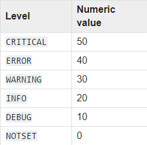

# Aiogram Yandex.Cloud serverless example

[![Yandex.Cloud](https://img.shields.io/badge/Yandex.Cloud-functions-9cf?style=flat-square&logo=data:image/png;base64,iVBORw0KGgoAAAANSUhEUgAAABwAAAAcCAYAAAByDd+UAAAABGdBTUEAALGPC/xhBQAAACBjSFJNAAB6JgAAgIQAAPoAAACA6AAAdTAAAOpgAAA6mAAAF3CculE8AAAABmJLR0QA/wD/AP+gvaeTAAAAB3RJTUUH5AgFFzIEtdttWgAABXdJREFUSMedlluoXUcdxn//mVn7ci5pPJecNMkhpj2mXkpLo7FahKCI+iAIhSoImjffVPogKqKICiIoRUWQIqIgPoj0QXwpaKEvVlNJqhZKY5LWxlrTpLnsc9l7nzXz//sws/ZahyIWBxZ771l75pvv+3/zzQj/R3v4V0YVYLLLfFKOqnJClVNm3GdGDfyiF/hZndh+9LTsGStvBOCbvzPEIalmISbWY+TuOvKuGDkRI8dVOaBGXxUMwJgsLfLT99/DN7YnXFmYgw/fKf8d8JE/GCKIGYuqvFmVe2Pi3XXkvhjZiJGVOuJjhBghKWh5DDCDfXPYe9/K7xfn+ILAM3WCj94lewG//0cjJSQE3mbGJ1X5gBpvUWUpRVydMkCMUMf2e0otqFmeqxfgfe+AxXnOJ+VLSfmNE5LvggHiHJ8AfgJ8DFjHmMMQszKh7v1M2oKlAqgG/QBH1yB4ls34kAgJOOcBfvAna3A/AjwKHBHJg81mdUGLXKqZ4c4YtndyXdRAUztmYZgBJWs4BB4ALoaZe4T9wBeB1U4fIuAAFZhO4PpNuPpafm6OsPEEO7aOW1vNDJs26IFzZbG5zQN3hY5zTgAnm7dWAJ2DGzfh/CX4179htAmTaWZoBilhm9uwvJQZNpMN+3m8tYgRuBx+dMaaVdxdVtFBzCBPPwO3Rm2dRMA7SIo4B1XA6hpRbVWZ6xfHtgy3gQtBJPcKbHReIg6u38hgo83MlFJD5zJ4UcCFAHVd2AgED4N+rmvDUOAG8M/gBBB6ZhyTDjmzLONoq9TCyuoduAyqqrzmA1e8Y2O3ZtAsthegVxXXtiq/InA1A8IisN5luDWGV69l6RoDqYJ3TDCeUMdjBk8dXOWQwa/rmoFIBggeQuiYSEDgJSdsBp8BV0xYw1qzTCYw3c2AzbbAMTXl6+b44aDPzoEVAE7WNfuk475+D5yH1MiZaV5MSmoYHgZus6aeDsbjzMh1AMU4o8KPnWfH+5wwqtyD5O3WMBwWcZO12SnGxcw+9xyzvDmx4rKdSccopaYYZyrHrZhKnCVuc8LJjFYmF5gblpDQWf8YeBGgMc2djZwNwM4416HpKK//CjldVKm859PmOOk6gN5nwCbmipy3BF4GCJXHq3FHIydAnXL9QsiTFKeNYuLiCy9x+3DAiSrwkBkPqjLAtWP7fRgOS/3aGl5BuAYQBBadcHQmJxlsN0I1Cz6IkfDyK3zLOw6rsp6UASUAmj2pCvv35Rom3XP2XRYYNZKuAgcbOUVgt86Dq6qYRWA6Za6OnBJyosw2vrRgvR4cvwN86IR+VucFNWoRCCKsA0vSAZzu5n9VoU2WOoIq6hy+OTGcy2mCZinvfTvcfrBdTCclL1BMFAQ2gDna1TCe5slcqY3zUMdZVpoq0gRzr4K1FTi+AYcOtlujE6LbwLMAn71fCCIcATrVgp1pdltjGO9gfgghICHAwhysLMPaKhxYhjftz5sdayOwk1pPC5xtfgeB58sq5iFLNNnN7BpVvIcjh2F5Cdfvwb5FWJjPNatCMY7lc3MGmBGuAt8xuNlIHIDHStJ82Qn7Y4Rp3QEsZ6L3M5Yz986uG822KJMWsEvAV4DHAT53v8wAx2p8zzsuOce3k7KRtAVsDmG31wR7Eqg4Ug2um/F3EZ4Q4Zcx8pz32Off0w4WgN8+b/QDROOdW2O++9RznBrtZGMIrYG8ywzLk6rAtRC4UAXOec8Z7/iLc7wowqYZ9vADr7+Fznoev2BsjWF+wKEn/8bXro04jTCYAQpT53g1BM6HwNkq8OcQeDZ4LvuKLVPsqx/83/fq1/3jMz83BhXz411OA58SoRLhnHM86RxnveMfgx7bdYRHPv6GLu572n8A49GP6YuI+gEAAAAldEVYdGRhdGU6Y3JlYXRlADIwMjAtMDgtMDVUMjM6NTA6MDQrMDM6MDC0bSm9AAAAJXRFWHRkYXRlOm1vZGlmeQAyMDIwLTA4LTA1VDIzOjUwOjA0KzAzOjAwxTCRAQAAAABJRU5ErkJggg==)](https://cloud.yandex.ru/)

Пример простого Telegram бота на Aiogram для Yandex.Cloud functions.
## AWS Lambda & API Gateway VS Yandex.Cloud functions
|  | AWS Lambda & API Gateway | Yandex.Cloud functions |
|:-:|:-:|:-:|
| Удобство создания функции | - (создавать нужно не только функцию, но и триггер из API Gateway) | + |
| Автоматическая установка пакетов | - (приходятся вручную добавлять в пакет для загрузки) | + (достаточно создать файл `requirements.txt`) |
| Поддержка асинхронности | +- (нужно самостоятельно запускать loop из синхронного хендлера) | + (работает "из коробки") |
| Поддержка Python 3.8 | + | - |
| Цена | + (выходит очень дёшево и есть огромный free tier) | - (примерно 50 рублей за миллион вызовов, бесплатно только в пробный период (2 месяца)) |
## Настройка бота
- [Создайте бота у Botfather](https://core.telegram.org/bots#6-botfather)
### Создание функции в Яндекс.Облаке
- [Перейдите в консоль Яндекс.Облака](https://console.cloud.yandex.ru/)
- Создайте платёжный профиль и облако
- В меню слева выберите Cloud Functions
- Создайте функцию
- В редакторе выберите среду выполнения `python37-preview` (**Это важно**)
### Загрузка кода в функцию
#### С помощью zip-файла
- Склонируйте данный репозиторий (`git clone https://github.com/DavisDmitry/aiogram-yandex.cloud-serverless-example`)
- Перейдите в директорию репозитория
- Поместите файлы `main.py` и `requierements.txt` в zip архив вручную или с помощью bash-скрипта: `./create-package.sh`
- Загрузите zip-архив в функцию Яндекс.Облака
- Укажите точку входа `main.handler`
- Выберите сервисный аккаунт или создайте новый
- Установите переменные окружения, они описаны ниже
#### С помощью редактора
- Создайте файлы `main.py` и `requirements.txt`
- Скопируйте содержимое из аналогичный файлов в репозитории
- Укажите точку входа `main.handler`
- Выберите сервисный аккаунт или создайте новый
- Установите переменные окружения, они описаны ниже
#### Переменные окружения:
- `TOKEN`: Bot API token, полученный от botfather
- `LOGGING_LEVEL`: уровень логирования (опцианально), по умолчанию - `info`

    

### Profit!

    

## P.S.
Код в данном репозитории почти полностью повторяет [другую мою работу](https://github.com/DavisDmitry/aiogram-aws-serverless-example). Serverless технологии очень похожи у разных провайдеров.

Я бы и дальше использовал AWS, так как цена там сильно меньше, а процесс деплоя можно в значительной степени автоматизировать с помощью CLI. Однако недавно мне пришло "письмо счастья", в котором было написано, что дальше использовать AWS я смогу только подтвердив свой домашний адрес.

Сделать это довольно сложно, так как Amazon требует прислать чеки оплаты коммунальных платежей. А в случае, если оплату производишь не ты нужно дополнительно добавить ещё и платёжные реквизиты того, кто платит. А именно так и есть в моём случае. Учитывая использование онлайн оплаты никаких чеков нет, а если бы и были, то вряд ли бы американская тех.поддержка их приняла.

Так я и перешёл на Яндекс.Облако и был приятно удивлён простоте создания функции и загрузки кода. Хотя цена всё равно кусается.
